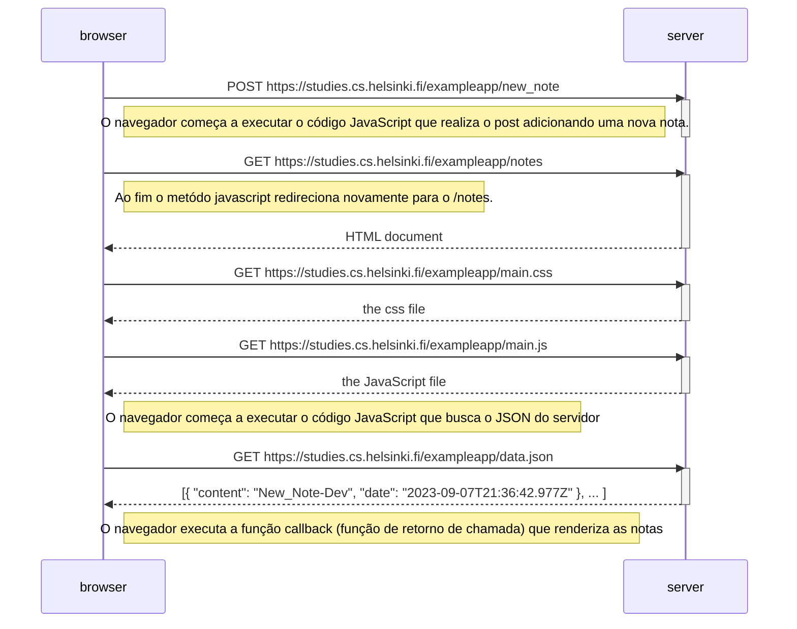

```mermaid
    sequenceDiagram

      participant browser

      participant server
      
      browser->>server: POST https://studies.cs.helsinki.fi/exampleapp/new_note
      activate server 
      Note right of browser: O navegador começa a executar o código JavaScript que realiza o post adicionando uma nova nota.             
      deactivate server
        
      browser->>server: GET https://studies.cs.helsinki.fi/exampleapp/notes
      activate server
      Note right of browser: Ao fim o metódo javascript redireciona novamente para o /notes.
      server-->>browser: HTML document
      deactivate server

      browser->>server: GET https://studies.cs.helsinki.fi/exampleapp/main.css
      activate server
      server-->>browser: the css file
      deactivate server

      browser->>server: GET https://studies.cs.helsinki.fi/exampleapp/main.js
      activate server
      server-->>browser: the JavaScript file
      deactivate server

      Note right of browser: O navegador começa a executar o código JavaScript que busca o JSON do servidor
      browser->>server: GET https://studies.cs.helsinki.fi/exampleapp/data.json
      activate server
      server-->>browser: [{  "content": "New_Note-Dev", "date": "2023-09-07T21:36:42.977Z" }, ... ]
      deactivate server
      Note right of browser: O navegador executa a função callback (função de retorno de chamada) que renderiza as notas
```