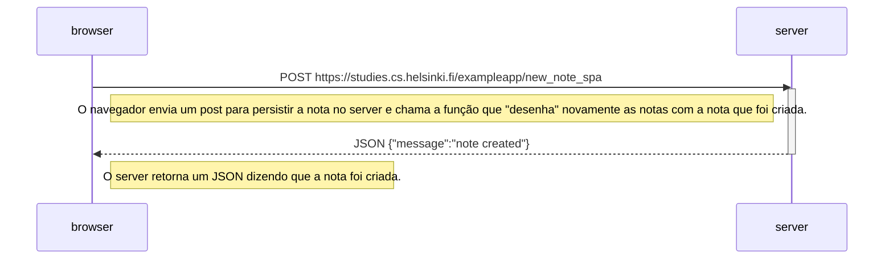

```mermaid
   sequenceDiagram

    participant browser

    participant server

    browser->>server: POST https://studies.cs.helsinki.fi/exampleapp/new_note_spa
    activate server
    Note right of browser: O navegador envia um post para persistir a nota no server e chama a função que "desenha" novamente as notas com a nota que foi criada.
    server-->>browser: JSON {"message":"note created"}
    deactivate server
    Note right of browser: O server retorna um JSON dizendo que a nota foi criada.
```